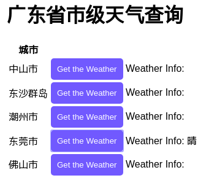

## Vanilla React weather app implementation based on REST API services

### Task List
- [x] ~~Skeleton~~
- [x] ~~Data fetching~~
     - [x] ~~adcode~~
     - [x] ~~weather info~~
- [ ] better code organization
- [ ] engaging UI
- [ ] localstorage features
- [ ] friendly README

### 项目描述
- 使用create-react-app建立起项目的脚手架
- 使用高德地图的行政区域查询接口和天气查询接口


### Current Status Show


### Installation
```shell
git clone https://github.com/lewenweijia/vanilla-react-weather-app.git
cd vanilla-react-weather-app
yarn install
yarn start

# To build the app for production, run the following command:
yarn build
```


### LICENSE
MIT
